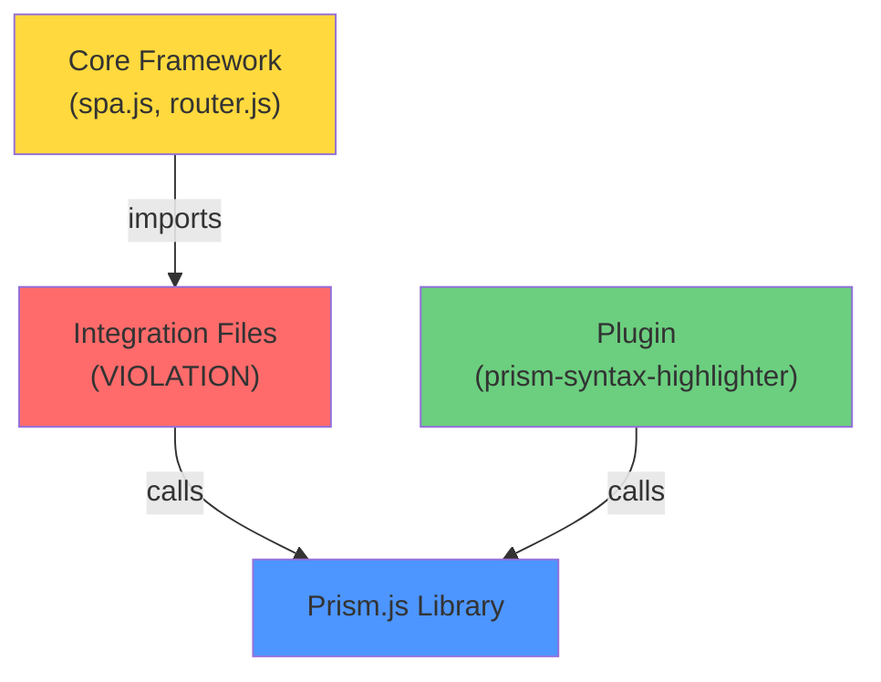
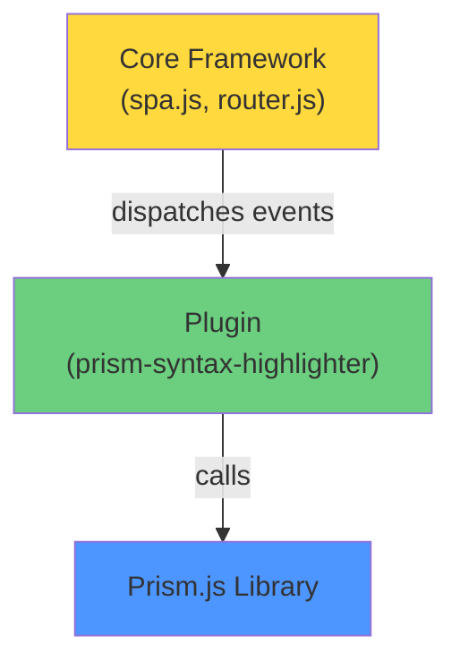
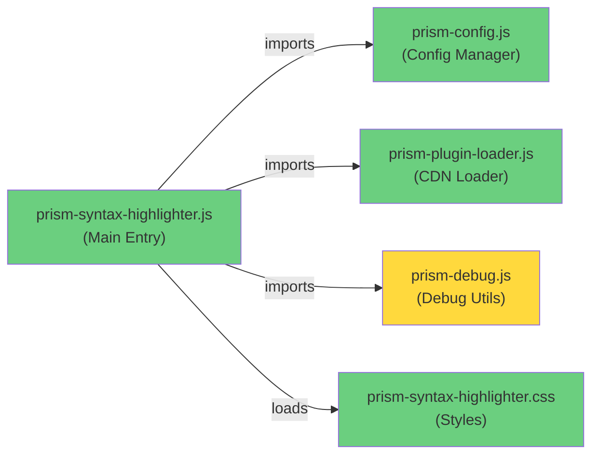

# Prism.js Audit - Detailed Findings & Code Examples

---

## SECTION 1: CODE EXAMPLES & VIOLATIONS

### Violation #1: `/src/integrations/prism.js` - Duplicate Event Listener

**The Problem Code** (Complete File):
```javascript
// File: /src/integrations/prism.js (16 lines)
// Re-highlight after every route change (router dispatches "route:after")
document.addEventListener('route:after', () => {
    if (window.Prism && typeof window.Prism.highlightAllUnder === 'function') {
        const main = document.querySelector('main.site-main') || document.querySelector('main');
        if (main) window.Prism.highlightAllUnder(main);
    }
});

// Also try once on DOM ready (first paint)
document.addEventListener('DOMContentLoaded', () => {
    if (window.Prism && typeof window.Prism.highlightAllUnder === 'function') {
        const main = document.querySelector('main.site-main') || document.querySelector('main');
        if (main) window.Prism.highlightAllUnder(main);
    }
});
```

**Why This Violates Plugin Architecture**:
- ❌ Located in `/src/integrations/` (core framework, not plugin)
- ❌ Hardcoded Prism method calls (`window.Prism.highlightAllUnder`)
- ❌ Assumes Prism is always available globally
- ❌ Duplicates functionality already in the plugin

**The Correct Implementation** (Plugin):
```javascript
// File: /src/plugins/prism/prism-syntax-highlighter.js (lines 61-73)
if (spa.events) {
    spa.events.addEventListener('route:after', (event) => {
        const main = document.querySelector('#app-shell');
        if (main) {
            applyPerBlockPrismConfig(main);
            highlightCode(main, prismConfig);
            addCustomHeaders(main);
        }
    });
}
```

**Key Differences**:
| Aspect | Integration File | Plugin File |
|--------|------------------|------------|
| Location | Core framework | Plugin directory |
| Event Source | `document` | `spa.events` |
| Prism Calls | Direct `window.Prism` | Via plugin functions |
| Configuration | None | Uses `prismConfig` |
| Removability | Requires deletion | Removed via config |

---

### Violation #2: `/src/integrations/prism-loader.js` - Unused Legacy Code

**The Problem Code** (Lines 1-26):
```javascript
// File: /src/integrations/prism-loader.js
export async function loadPrismBase(theme = 'prism-tomorrow') {
    const base = "https://cdn.jsdelivr.net/npm/prismjs@1.29.0";
    const css = `${base}/themes/${theme}.min.css`;
    const js = `${base}/prism.min.js`;
    loadCSS(css);
    await loadJS(js);
}

export async function loadPrismLanguages(langs = ['javascript', 'css', 'json']) {
    const base = "https://cdn.jsdelivr.net/npm/prismjs@1.29.0/components";
    await Promise.all(langs.map(lang => loadJS(`${base}/prism-${lang}.min.js`)));
}

export async function loadPrismPlugins(plugins = ['toolbar', 'line-numbers']) {
    const base = "https://cdn.jsdelivr.net/npm/prismjs@1.29.0/plugins";
    for (const p of plugins) {
        await Promise.all([
            loadCSS(`${base}/${p}/prism-${p}.min.css`).catch(() => {}),
            loadJS(`${base}/${p}/prism-${p}.min.js`).catch(() => {})
        ]);
    }
}
```

**Why This Violates Plugin Architecture**:
- ❌ Located in core framework (`/src/integrations/`)
- ❌ Hardcoded CDN version (1.29.0)
- ❌ Not imported or used anywhere
- ❌ Duplicates plugin's own loader

**The Correct Implementation** (Plugin):
```javascript
// File: /src/plugins/prism/prism-plugin-loader.js (lines 29-108)
export async function loadPrismPlugins(pluginConfigs, cdnBase) {
    // Configuration-driven, not hardcoded
    for (const plugin of pluginConfigs) {
        const jsUrl = cdnBase + plugin.jsPath;
        const cssUrl = cdnBase + plugin.cssPath;
        
        // Load with dependency resolution
        await loadJS(jsUrl);
        if (plugin.cssPath) await loadCSS(cssUrl);
    }
}
```

**Key Differences**:
| Aspect | Integration File | Plugin File |
|--------|------------------|------------|
| CDN Version | Hardcoded 1.29.0 | From config |
| Dependencies | Not handled | Resolved |
| Configuration | None | Config-driven |
| Usage | Unused | Active |

---

### Violation #3: `package.json` - Mandatory Core Dependency

**The Problem Code**:
```json
{
  "name": "phantomspa",
  "version": "0.0.1",
  "dependencies": {
    "dompurify": "^3.3.0",
    "jsdom": "^27.1.0",
    "prismjs": "^1.30.0",
    "snarkdown": "^2.0.0"
  }
}
```

**Why This Violates Plugin Architecture**:
- ❌ Makes Prism mandatory for ALL users
- ❌ Syntax highlighting is optional, not core
- ❌ Bloats bundle for users not using the plugin
- ❌ Violates principle: plugins manage own dependencies

**The Correct Approach**:
```json
{
  "dependencies": {
    "dompurify": "^3.3.0",
    "jsdom": "^27.1.0",
    "snarkdown": "^2.0.0"
  },
  "optionalDependencies": {
    "prismjs": "^1.30.0"
  }
}
```

---

## SECTION 2: VISUAL DIAGRAMS

### Current Architecture (PROBLEMATIC)



### Correct Architecture (COMPLIANT)



### Plugin File Structure



---

## SECTION 3: STEP-BY-STEP FIX INSTRUCTIONS

### Fix #1: Delete `/src/integrations/prism.js`

**Steps**:
1. Verify the file exists: `ls -la htdocs/src/integrations/prism.js`
2. Check it's not imported anywhere: `grep -r "prism-loader\|prism\.js" --include="*.js" htdocs/src/`
3. Delete the file
4. Verify plugin still works

**Expected Impact**:
- ✅ No breaking changes (plugin handles highlighting)
- ✅ Cleaner core framework
- ✅ Removes redundant code

**Verification**:
```bash
# Should return nothing
grep -r "from.*prism\.js\|import.*prism\.js" htdocs/src/
```

### Fix #2: Delete `/src/integrations/prism-loader.js`

**Steps**:
1. Verify not imported: `grep -r "prism-loader" --include="*.js" htdocs/src/`
2. Delete the file
3. Confirm plugin's loader is used instead

**Expected Impact**:
- ✅ No breaking changes (unused file)
- ✅ Removes confusion
- ✅ Cleaner codebase

**Verification**:
```bash
# Should show plugin's loader is used
grep -r "prism-plugin-loader" htdocs/src/plugins/prism/
```

### Fix #3: Remove `prismjs` from `package.json`

**Steps**:
1. Open `package.json`
2. Remove line: `"prismjs": "^1.30.0",`
3. Run: `npm install`
4. Test plugin loading

**Expected Impact**:
- ✅ Reduces bundle size (~200KB)
- ✅ Makes plugin truly optional
- ⚠️ Users must install prismjs separately if using plugin

**Verification**:
```bash
npm list prismjs  # Should show "not installed"
```

---

## SECTION 4: CONFIGURATION REFERENCE

### Plugin Configuration (app-config.json)

```json
{
  "plugins": {
    "prism-syntax-highlighter": {
      "path": "/src/plugins/prism/prism-syntax-highlighter.js",
      "options": {
        "theme": "tomorrow",
        "cdnVersion": "1.29.0",
        "cdnBase": "https://cdn.jsdelivr.net/npm/prismjs@{version}",
        "languages": ["markup", "css", "javascript", "json"],
        "plugins": [
          {
            "name": "line-numbers",
            "jsPath": "/plugins/line-numbers/prism-line-numbers.min.js",
            "cssPath": "/plugins/line-numbers/prism-line-numbers.min.css"
          }
        ]
      }
    }
  }
}
```

---

## SECTION 5: TESTING & VERIFICATION

### Pre-Fix Checklist

- [ ] Syntax highlighting works on current page
- [ ] Line numbers display correctly
- [ ] Copy button functions
- [ ] Settings panel opens/closes
- [ ] No console errors

### Post-Fix Checklist

- [ ] `/src/integrations/prism.js` deleted
- [ ] `/src/integrations/prism-loader.js` deleted
- [ ] `prismjs` removed from `package.json`
- [ ] `npm install` completes successfully
- [ ] Syntax highlighting still works
- [ ] No console errors about missing files
- [ ] Plugin can be disabled via config
- [ ] All tests pass

### Verification Commands

```bash
# Verify files deleted
test ! -f htdocs/src/integrations/prism.js && echo "✅ prism.js deleted"
test ! -f htdocs/src/integrations/prism-loader.js && echo "✅ prism-loader.js deleted"

# Verify dependency removed
grep -q "prismjs" package.json && echo "❌ prismjs still in package.json" || echo "✅ prismjs removed"

# Verify no imports of deleted files
grep -r "from.*integrations/prism" htdocs/src/ && echo "❌ Still importing deleted files" || echo "✅ No imports of deleted files"
```

---

## SUMMARY TABLE

| Violation | File | Action | Impact | Effort |
|-----------|------|--------|--------|--------|
| Duplicate event listener | `/src/integrations/prism.js` | Delete | None | 1 min |
| Unused loader | `/src/integrations/prism-loader.js` | Delete | None | 1 min |
| Mandatory dependency | `package.json` | Remove line | -200KB | 2 min |

**Total Fix Time**: ~5 minutes  
**Risk Level**: Very Low (no breaking changes)  
**Benefit**: Full plugin architecture compliance

